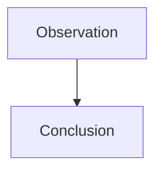

<!-- ═══════════════════════════════════════════════
  PIPELINE CHECKLIST (delete this block before publishing)
  ─────────────────────────────────────────────────
  [ ] title         — short, optional for notes
  [ ] description   — 1-2 sentences for OG/Google preview
  [ ] image         — drop a cover.jpg (1200×630) in this folder (optional)
  [ ] date          — set to the moment of the observation
  ═══════════════════════════════════════════════ -->

Write your note here. Markdown fully supported.

<!-- Images: drop the file next to index.md and reference it as: -->
<!--  -->

<!-- Mermaid diagram: -->
<!--

-->
