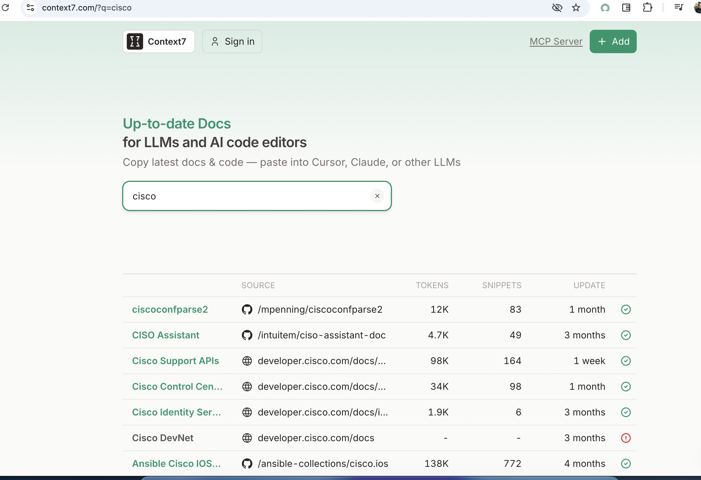

## Table of Contents
- [Introduction](#introduction)
- [Understanding Local LLMs](#understanding-local-llms)
- [Email RAG Explained](#email-rag-explained)
- [Setting up the Environment](#setting-up-the-environment)
- [Implementing Local LLM for Email RAG](#implementing-local-llm-for-email-rag)
- [Challenges and Solutions](#challenges-and-solutions)
- [Conclusion](#conclusion)

## Introduction
To understand basic LLM stuff, the models gets trained on a set of data to a particular date, and the data used for training is usally not everything in the whole world, 

So for example, in my case, Cisco has a lot of OS models , with many Command versions, usually whenever i ask Google's gemin, it shares to me a command that actually not suitable for my version of the OS,

In that case, i need some way to fetch the up to date documentation for the LLM to consuklt for my question.

Context7 is a tool (MCP server) service that provides your LLM with the up to date documentation for many libraries in case you are asking fort a command or a class/funstion for your code generation.

Many times, whenever you ask an LLM to generate a command or code, it will generate something random if it does not find the answer in its trained data or using its search tools.

Context7 handles the part where it will get the correct documentation for the AI model to consult.

For us network engineers for example, you can find Context 7 support for our Command lines, and scripting libraries, being kept up to date: 



You have to 1st sign up for Context7 API key for free. @ https://context7.com/.

then its easy peasy as follows.

## Understanding basic underlying technologies in LLM

## Setup

1. We need to clone the Context7 Repo, to build the docker image : 
   `git clone https://github.com/upstash/context7.git`

2. Now that we clone the Dockerfile, run : 
   `docker build -t context7-mcp .`

3. edit the Gemini's Settings.json, or the coresponding configuration file , for Claude desktop or OpenAI's Codex
   ```bash
   $ vim  ~/.gemini/settings.json
   {
     "mcpServers": {
       "Сontext7": {
         "autoApprove": [],
         "disabled": false,
         "timeout": 60,
         "command": "docker",
         "args": [
           "run",
           "-i",
           "--rm",
           "-e",
           "CONTEXT7_API_KEY=YOUR-CONTEXT7-API-KEY",
           "context7-mcp"
         ],
         "transportType": "stdio"
       }
     },
     "selectedAuthType": "gemini-api-key",
     "theme": "Default"
   }
   ```


## References

- kotaemon , An open-source clean & customizable RAG UI for chatting with your documents. Built with both end users and developers in mind. https://github.com/Cinnamon/kotaemon
- Llama.cpp Tutorial: A Complete Guide to Efficient LLM Inference and Implementation https://www.datacamp.com/tutorial/llama-cpp-tutorial
- GGUF versus GGML https://www.ibm.com/think/topics/gguf-versus-ggml
- Data Is Fueling the AI Revolution. What Happens When It Runs Out? https://alumni.berkeley.edu/california-magazine/online/data-is-fueling-the-ai-revolution-what-happens-when-it-runs-out/
