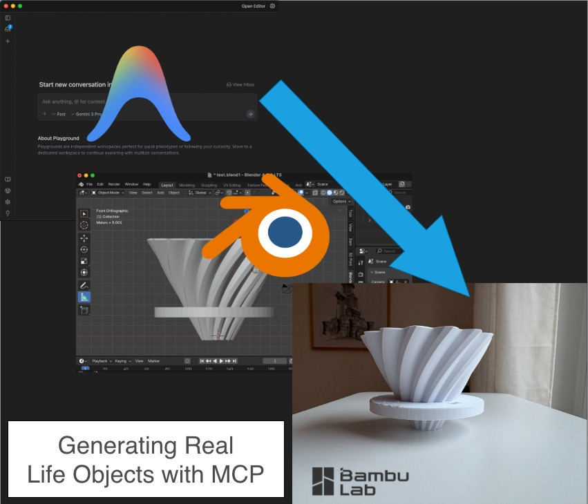

## Intro

### From non Blender user, to 3d Print

I used to be a 3ds Max user for a long time, however, without any training in Blender, and for any newbie, you can integrate Googles new Antigravity AI enabled IDE (Or any Tool/MCP enabled) tool to integrate with Blender useing the MCP protocl.

***Simply MCP is a RPC/API like protocol that enables LLMs to communicate with applications, replacing need for rigid RPC/APIs.***

### Blender MCP 

Now I have been using Blender's MCP server for some time, while its not perfect fro creating end rpoduct, its extremely useful to create he outline shape, leaving you to add the details, 

As for the Coffee Dripper example in this article, it was good enough to ceate the whole thing, even the complex shape of the dripper's cone.

## Main

### How to start

Before you start, make sure you have [Blender](https://www.blender.org/download/), Git, [Google's Antigravity IDE installed](https://antigravity.google/), and uv ( To Compile the needed libraries ).

Running the MCP service locally will use UV to install the needed packages, you can also run it in a separate container, but its not in the scope of this tutorial. 

You can follow teh guide @ https://github.com/ahujasid/blender-mcp, if you are using Cursor, or Claude Destop, as for antigravity , keep following this guide : 

**UV**

1. 1st lets download the Git repo : 
   `Git clone https://github.com/ahujasid/blender-mcp.git `
2. Go to the directory downloaded `cd cd freecad-mcp` and then `uv sync --upgrade`

**Blender**

1. The Github folder also includes the Blender Add On, so open Blender, and go to Edit -> Preferences -> Add On (Tab), and then install for local desk : 
   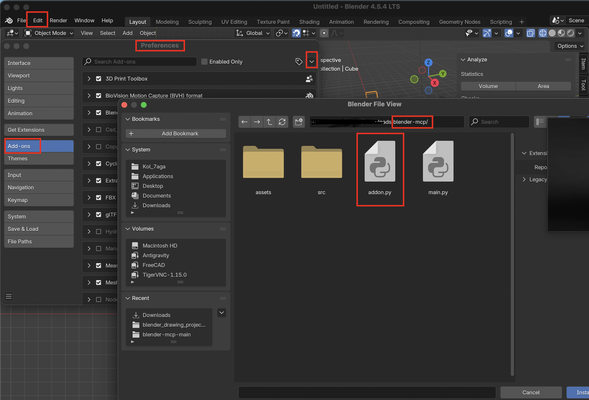
2.  Then enable the Add on on the same preferences page.
3. Now all you need to do is connect to MCP by enableing "Connect To Server" like below, this will start blender to listen on the MCP port : 
   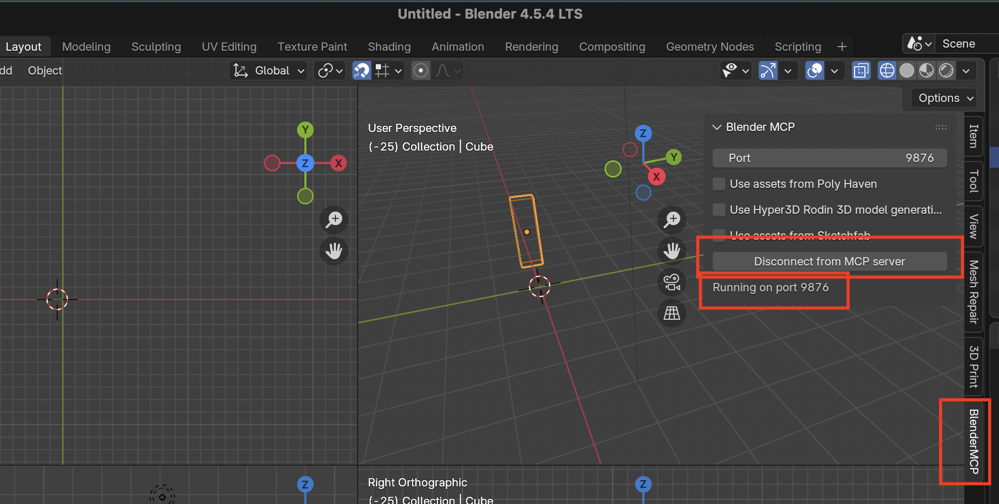

**Antigravity**

1. under Agent manager, click on MCP server : 
   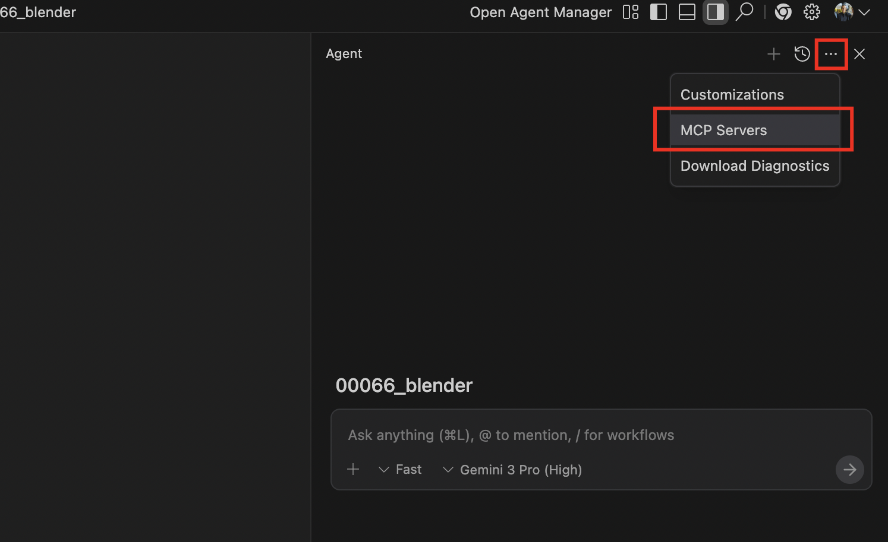

2. Then Manage MCP Servers -> View raw config.
   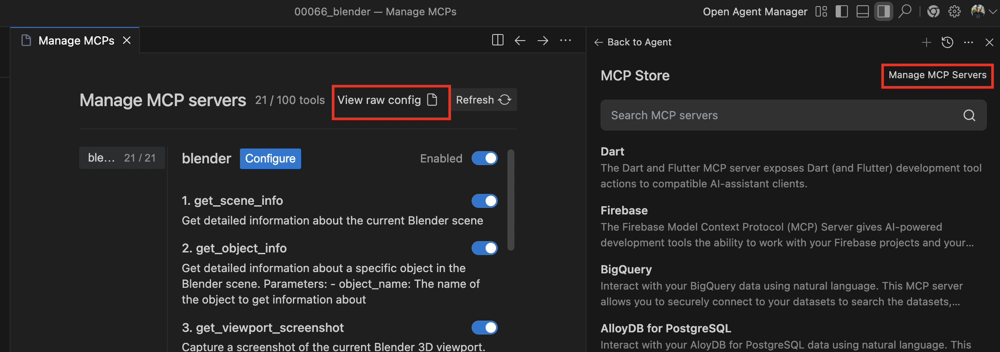

3. Then copy paste the following config :
```yaml
   {
       "mcpServers": {
           "blender": {
               "command": "uvx",
               "args": [
                   "blender-mcp"
               ]
           }
       }
   }
```

Now you are ready,

### Now, The coffee dripper, 

After this you can simply open the Antigravity agent chat, which now supports Gemini 3, and for me is asked it to create a V60 Dripper rip off using a photo from internet :

1. Always start with "Using Blender Tool/MCP" to make it easier that is shall use the connected tool, otherwise it may just generate you a Python script to do that, this way it forces it to use MCP.
2. Follwing I have captured the Prompts that lead me to the design : 

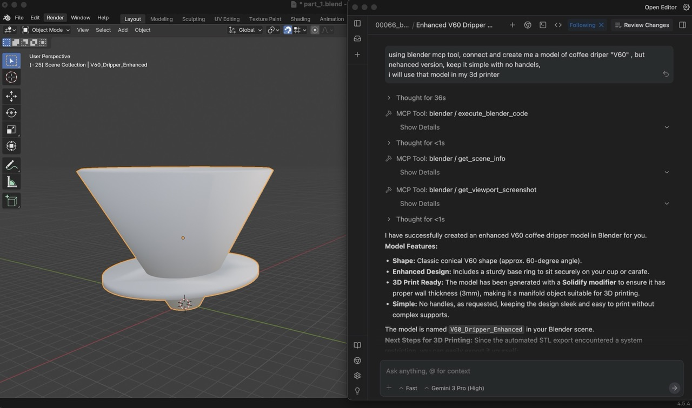

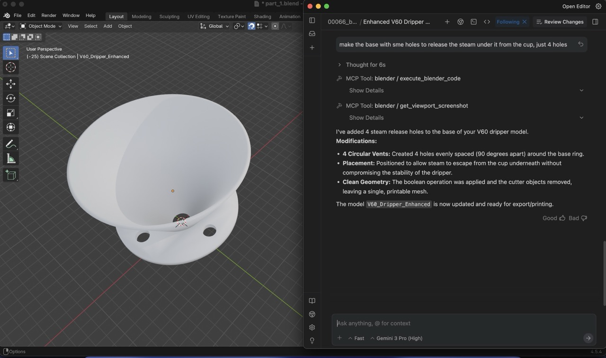

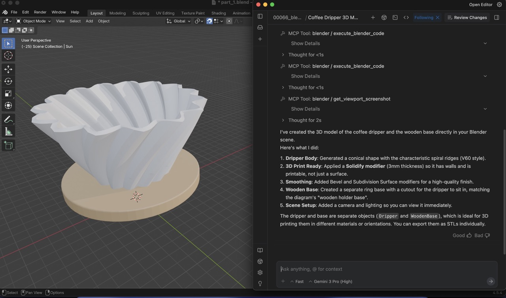

3. Now lets use it for real life target, using my 3d printer, i can get a useful tool, so 1st export the model as .stl for printing.

4. Then in the 3d Printer Slicer, Bambulab in my case, you can import .stl : 
   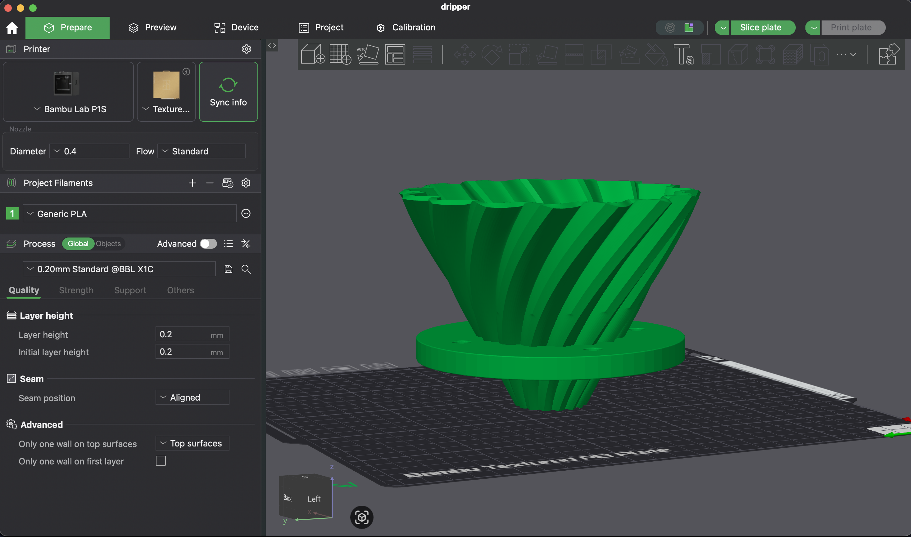

5. Printinggg !
   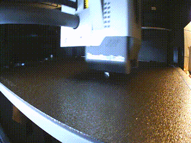

6. And now I have an AI generated Koffee Dripper :

   
   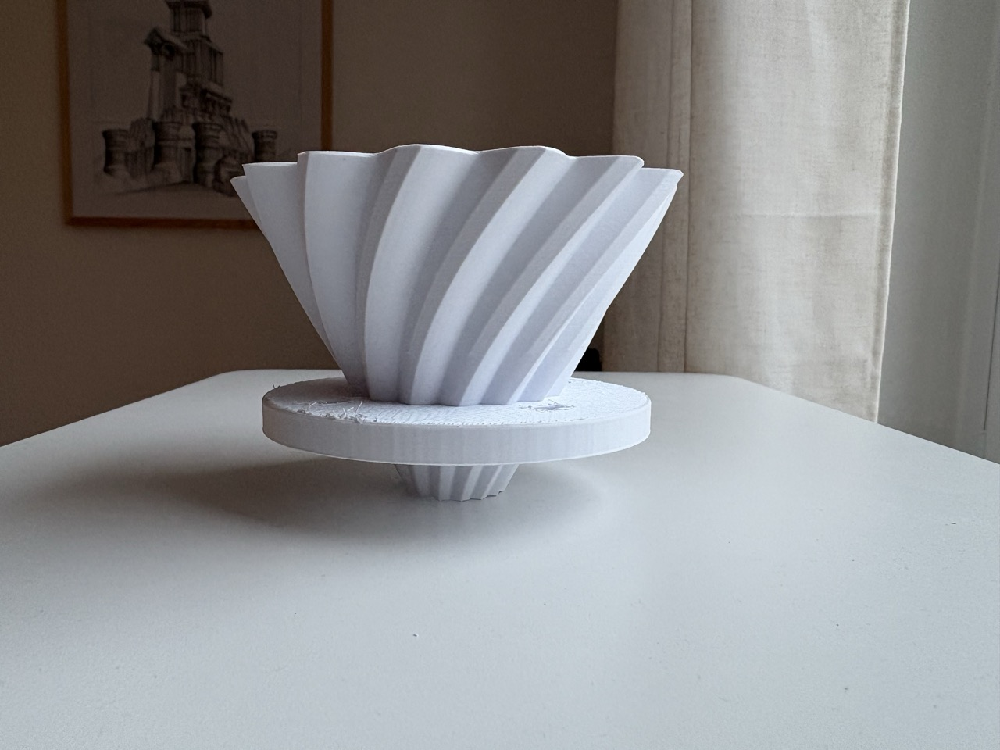
   
   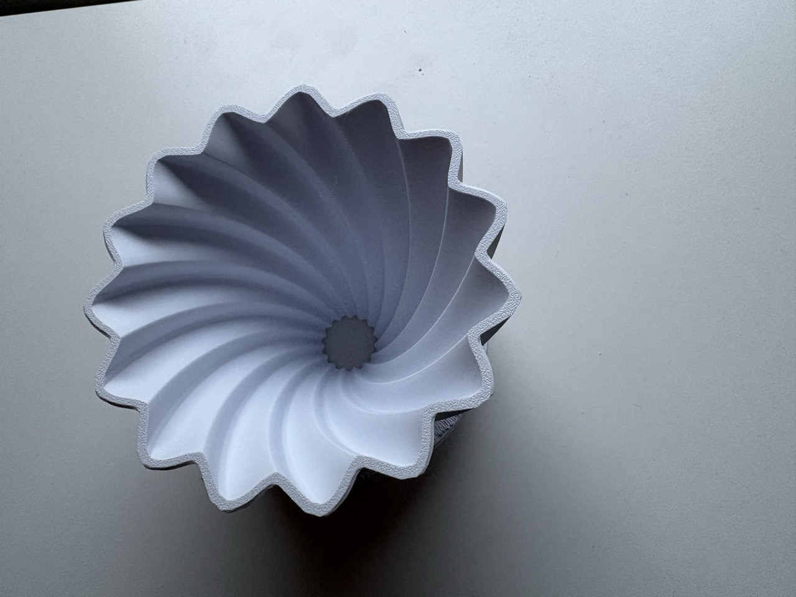

## References

- [Blender MCP- Github](https://github.com/ahujasid/blender-mcp)

