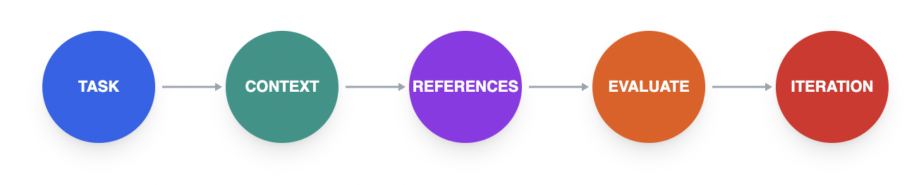

```
## Thoughts to follow

### Unorganized thoughts

- [Prompting Cursor with Wispr Flow](https://wisprflow.ai/post/prompting-cursor-with-wispr-flow)

### Prompt Engineering & Chaining

- **Chaining is better** - Allows for precise, simple outputs with simple system prompts, avoids overloading tasks, and ensures modularity.
  - *Check:* Chain of Thought vs Chain of Density.
  - *Check:* Latency trade-offs vs Accuracy gains.
  - *Read:* [Prompt Chaining vs Monolithic Prompts](https://www.promptingguide.ai/techniques/prompt_chaining)
  - [Prompt Engineering Tools](https://mirascope.com/blog/prompt-engineering-tools)

### Context Engineering

- **Context Pruning** - Reduce API/Token intensity by passing only necessary parts of chat history (e.g., via small models).
  - *Check:* "Needle in a Haystack" performance metrics.
  - *Check:* Contextual Retrieval strategies (finding the right chunks).
  - *Read:* [Compressing Context for LLMs](https://arxiv.org/abs/2310.06201) (or *[Context Pruning Techniques](https://www.jailbreak.chat/blog/context-pruning)*)
- **Context Summarization** - Reduce tokens by summarizing redundant inputs using simpler words (e.g., via small models).
  - *Check:* Recursive summarization techniques.
  - *Check:* Entity-centric summarization for maintaining key details.
  - *Read:* [Conversation Summarization with LLMs](https://www.pinecone.io/learn/series/langchain/conversation-summarization/)
- **Context Offloading** - Store context externally (files, object storage, Redis, Postgres) to persist state without wasting context window.
  - *Check:* Redis for hot/short-term memory (fast key-value).
  - *Check:* Postgres/Vector DBs for long-term archival.
  - *Read:* [Memory Management for AI Agents](https://redis.io/learn/howtos/solutions/ai/memory-management)

### Tooling & Determinism

- **Tool Loadout** - Be very specific on which tools to use. Provide exact descriptions of what they can do in the prompt to help the AI select the right tool.
  - *Check:* Pydantic schemas for strict validation.
  - *Check:* Docstring best practices for LLM tool comprehension.
  - *Read:* [Optimizing Tool Selection](https://python.langchain.com/docs/how_to/tool_calling/)

### Multi-Agent Architecture

- **Context Quarantine** - Separate contexts for different threads/agents to avoid pollution, even if token heavy.
  - *Check:* Sandboxing environments for agent safety.
  - *Check:* Cost/Token usage per isolated agent.
  - *Read:* [Building Effective Agents - Isolation](https://www.anthropic.com/research/building-effective-agents)
- **LangChain Supervisor** - Use a supervisor to manage and route tasks between agents.
  - *Check:* LangGraph state management.
  - *Check:* Hierarchical agent teams patterns.
  - *Read:* [LangGraph - Hierarchical Agent Teams](https://langchain-ai.github.io/langgraph/tutorials/multi_agent/hierarchical_agent_teams/)
- **Contract Net Protocol (CNP)** - Use for Multi-Agent Communication and task bidding/allocation.
  - *Check:* FIPA standards for agent negotiation.
  - *Check:* Auction-based task allocation mechanisms.
  - *Read:* [Contract Net Protocol - Wikipedia](https://en.wikipedia.org/wiki/Contract_Net_Protocol)

# Overview



# Example

# Reference

- [What is prompt chaining?](https://www.ibm.com/think/topics/prompt-chaining)
- [Context Engineering - LangChain](https://github.com/langchain-ai/how_t...)
- [Cognition - Don’t Build Multi-Agents](https://cognition.ai/blog/dont-build-multi-agents#principles-of-context-engineering)
- [How Contexts Fail and How to Fix Them](https://www.dbreunig.com/2025/06/22/how-contexts-fail-and-how-to-fix-them.html)
- hybrid Mamba/transformer architecture [IBM Granite](https://www.ibm.com/new/announcements/ibm-granite-4-0-hyper-efficient-high-performance-hybrid-models)
- [How to Build an AI Agent](https://www.ibm.com/think/topics/how-to-build-an-ai-agent)
- [The State of LLM Reasoning Model Training](https://magazine.sebastianraschka.com/p/the-state-of-llm-reasoning-model-training)
- [Nemotron Orchestrator - Tool Calling Model](https://huggingface.co/nvidia/Nemotron-Orchestrator-8B)
[Sequence to read] :
- 1. [Building Effective Agents](https://www.anthropic.com/research/building-effective-agents)
- 1. [LangGraph - Adaptive RAG](https://langchain-ai.github.io/langgraph/tutorials/rag/langgraph_adaptive_rag_local/)
- 1. [LangGraph - Plan and Execute](https://langchain-ai.github.io/langgraph/tutorials/plan-and-execute/plan-and-execute/)
- 1. [LangGraph - Multi Agent](https://langchain-ai.github.io/langgraph/tutorials/multi_agent/hierarchical_agent_teams/)
- [Prompting Cursor with Wispr Flow](https://wisprflow.ai/post/prompting-cursor-with-wispr-flow)
-[The Decreasing Value of Chain of Thought in Prompting](https://gail.wharton.upenn.edu/research-and-insights/tech-report-chain-of-thought/)
