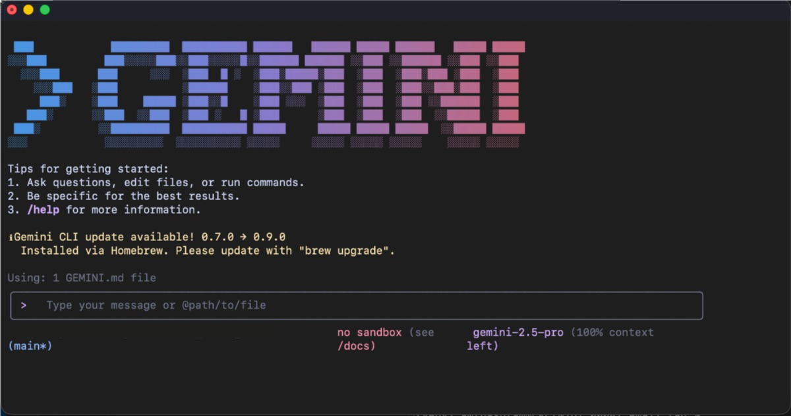
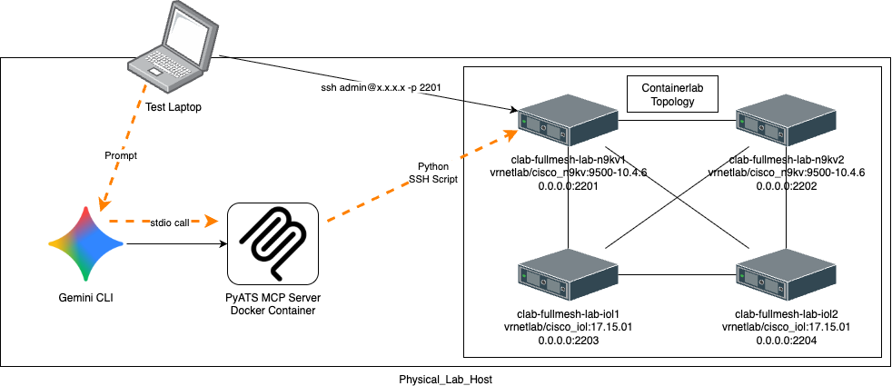

## Overview

### Starting with result

Starting with the final result, here I am asking Gemini to get me the software version of one of my switches : 

```bash
$ gemini -m gemini-2.5-flash 

 ███            █████████  ██████████ ██████   ██████ █████ ██████   █████ █████
░░░███         ███░░░░░███░░███░░░░░█░░██████ ██████ ░░███ ░░██████ ░░███ ░░███
  ░░░███      ███     ░░░  ░███  █ ░  ░███░█████░███  ░███  ░███░███ ░███  ░███
    ░░░███   ░███          ░██████    ░███░░███ ░███  ░███  ░███░░███░███  ░███
     ███░    ░███    █████ ░███░░█    ░███ ░░░  ░███  ░███  ░███ ░░██████  ░███
   ███░      ░░███  ░░███  ░███ ░   █ ░███      ░███  ░███  ░███  ░░█████  ░███
 ███░         ░░█████████  ██████████ █████     █████ █████ █████  ░░█████ █████
░░░            ░░░░░░░░░  ░░░░░░░░░░ ░░░░░     ░░░░░ ░░░░░ ░░░░░    ░░░░░ ░░░░░

╭─────────────────────────────────────────────────────────────────────────────────────╮
│  > get me the software verstion of clab-fullmesh-lab-n9kv1 and put it in cli table  │
╰─────────────────────────────────────────────────────────────────────────────────────╯

 
   1 +-------------------------+-----------------+
   2 | Device                  | Software Version|
   3 +-------------------------+-----------------+
   4 | clab-fullmesh-lab-n9kv1 | 10.4(6)         |
   5 +-------------------------+-----------------+
    
```bash

### Introduction

AI usage is no longer only for copy & paste to chatgpt to get info about an error, or to search how to do something, no longer is just a Google search replacement, 

In this article we will show a new way to get exposure to latest technologies if you are a Legacy Network engineer (Like Me).

Tools that will be used in this demonstration :

- Containerlab - Network Virtualization .
- Gemini CLI + Gemini API Key.
- Docker - for Containerlab Switches & PyATS Container.

### What are MCP servers?

To put it simply, its the API Gateways used by LLMs, normally when you write a script, you interact with your backend nodes using for example RestAPIs or gRPC, 

In the case of an LLM, while it can work with API endpoints, MCP servers have been specifcally created for the purpose, was initiated by anthropic, but nowadays its widely adopted by everybody.

What is it really conssists of, you may ask, on one sentence, its a bunch of System Prompts prepared for each application.

Indeed its mor complicated, this is to put it in simple words.

The MCP servers concept is mature in the very advanced Application spaces, however these days is just beginning to touch other fields, 

You know that, because even Cisco have not released any official MCP servers yet.

### What is PyATS ?

PyATS is a python library created by Cisco, mainly i am intrested in it, cuz it enables automation for legacy Cisco devices ([Cisco PyATS](https://developer.cisco.com/docs/pyats/)), which is not very compitable with APIs.

While we are talking about PyATS, its mainly for demonistartion, however please feel free to explore more.

### What is Gemini CLI ?



In this article we are using Gemini's API Key, as its the most generous for free users if you use Google's AI Studio API Key, otherwise for OpenAI & Anthropic's claude, you have to pay for token right away,

With Gemini's Pro tier, you get even more allowance on API calls and access to the gemini-pro models through API.

What is Gemini CLI ? its an Agentic terminal, eases tasks for example if you want to start controlling your devices directly not though copying and pasting to the chatot window, you can just use one of these tools, 

Mostly people use : 

- Gemini CLI
- OpenAI Codex
- Claude Desktop

However if you are more intrested in running things locally, you can explore running [Aider CLI](https://aider.chat/) with you local LLM though Ollama.

## Dive in

### Our test setup



For demonstration, we wont be using my daily operations network, we will be using a Containerlab setup running Cisco Nexus (full Cisco vNexus image) and IOS images (Cisco CML vIOL image),

a simple toplogy shown below using the containerlab inspect :

```bash
$ containerlab inspect fullmesh-lab.clab.yml
00:37:45 INFO Parsing & checking topology file=fullmesh-lab.clab.yml
╭─────────────────────────┬─────────────────────────────────┬────────────────────┬────────────────╮
│           Name          │            Kind/Image           │        State       │ IPv4/6 Address │
├─────────────────────────┼─────────────────────────────────┼────────────────────┼────────────────┤
│ clab-fullmesh-lab-iol1  │ cisco_iol                       │ running            │ 172.100.100.5  │
│                         │ vrnetlab/cisco_iol:17.15.01     │                    │ N/A            │
├─────────────────────────┼─────────────────────────────────┼────────────────────┼────────────────┤
│ clab-fullmesh-lab-iol2  │ cisco_iol                       │ running            │ 172.100.100.2  │
│                         │ vrnetlab/cisco_iol:17.15.01     │                    │ N/A            │
├─────────────────────────┼─────────────────────────────────┼────────────────────┼────────────────┤
│ clab-fullmesh-lab-n9kv1 │ cisco_n9kv                      │ running            │ 172.100.100.4  │
│                         │ vrnetlab/cisco_n9kv:9500-10.4.6 │ (health: starting) │ N/A            │
├─────────────────────────┼─────────────────────────────────┼────────────────────┼────────────────┤
│ clab-fullmesh-lab-n9kv2 │ cisco_n9kv                      │ running            │ 172.100.100.3  │
│                         │ vrnetlab/cisco_n9kv:9500-10.4.6 │ (health: starting) │ N/A            │
╰─────────────────────────┴─────────────────────────────────┴────────────────────┴────────────────╯
```bash

you can follow stes to setup your own containerlab setup @ https://containerlab.dev/install/ , we wont be covering this part.

### Preparing PyATS MCP Server container

Since this is an individual's effort to create this MCP server for Cisco, and since its not offically supprted, you have to build the docker image, which is very simple.

1) Clone the [pyATS_MCP](https://github.com/automateyournetwork/pyATS_MCP) repo to your local computer
   `git clone https://github.com/automateyournetwork/pyATS_MCP.git`

2) You need to update the `testbed.yaml` with your devices details, you can just follow the format from the examples set in  the exisitng Repo `testbed.yaml`, for our lab, the file looks like :
   ```
   # testbed.yaml
   
   ---
   devices:
     clab-fullmesh-lab-iol1:
       alias: "Containerlab IOL1"
       type: "router"
       os: "iosxe"
       platform: CSR1kv
       credentials:
         default:
           username: admin
           password: admin
         enable:
           password: admin
       connections:
         cli:
           protocol: ssh
           ip: 0.0.0.0
           port: 2203
           arguments:
             connection_timeout: 360
     clab-fullmesh-lab-iol2:
       alias: "Containerlab IOL2"
       type: "router"
       os: "iosxe"
       platform: CSR1kv
       credentials:
         default:
           username: admin
           password: admin
         enable:
           password: admin
       connections:
         cli:
           protocol: ssh
           ip: 0.0.0.0
           port: 2204
           arguments:
             connection_timeout: 360
     clab-fullmesh-lab-n9kv1:
       alias: "Containerlab N9KV1"
       type: "switch"
       os: "nxos"
       platform: N9KV
       credentials:
         default:
           username: admin
           password: admin
         enable:
           password: admin
       connections:
         cli:
           protocol: ssh
           ip: 0.0.0.0
           port: 2201
           arguments:
             connection_timeout: 360
     clab-fullmesh-lab-n9kv2:
       alias: "Containerlab N9KV2"
       type: "switch"
       os: "nxos"
       platform: N9KV
       credentials:
         default:
           username: admin
           password: admin
         enable:
           password: admin
       connections:
         cli:
           protocol: ssh
           ip: 0.0.0.0
           port: 2202
           arguments:
             connection_timeout: 360
   ```bash

   

3) The Docker file is already there, however we need to create an app directory and move "pyats_mcp_server.py" and "testbed.yaml" to 
   ```
   mkdir app
   cp testbed.yaml app
   cp pyats_mcp_server.py app
   ```bash

4) Then we can build the container : (If you are familiar with docker, this is a simple standard Ptyhon image, which will run the `pyats_mcp_server.py` python script copied to the `app`  folder)
   `docker build -t pyats-mcp-server .`

5) We dont need to run the container, it will be started and terminated by the Gemini CLI application, so we are good to go to next step.

### Using the MCP server

In Gemini CLIl, you can add your mcp servers under the `~/.gemini/settings.json`, now lets start : 

1. Assuming you have installed Gemini CLI and already authenticated, we need to edit `~/.gemini/settings.json`, replace `YOUR_FULL_PATH_TO/app` with the right path to your `app` folder on your machine:
   ```
   $ cat ~/.gemini/settings.json 
   {
     "theme": "ANSI",
     "selectedAuthType": "gemini-api-key",
     "mcpServers": {
       "pyats": {
         "command": "docker",
         "args": [
           "run",
           "-i",
           "--rm",
           "-e",
           "PYATS_TESTBED_PATH",
           "-v",
           "YOUR_FULL_PATH_TO/app:/app",
           "pyats-mcp-server"
         ],
         "env": {
           "PYATS_TESTBED_PATH": "/app/testbed.yaml"
         }
       }
     }
   }
   ```bash

2. Then we start  Gemini, i prefer to use the flash model as it has much higher limits : 
   ```
   $ gemini -m gemini-2.5-flash 
   
    ███            █████████  ██████████ ██████   ██████ █████ ██████   █████ █████
   ░░░███         ███░░░░░███░░███░░░░░█░░██████ ██████ ░░███ ░░██████ ░░███ ░░███
     ░░░███      ███     ░░░  ░███  █ ░  ░███░█████░███  ░███  ░███░███ ░███  ░███
       ░░░███   ░███          ░██████    ░███░░███ ░███  ░███  ░███░░███░███  ░███
        ███░    ░███    █████ ░███░░█    ░███ ░░░  ░███  ░███  ░███ ░░██████  ░███
      ███░      ░░███  ░░███  ░███ ░   █ ░███      ░███  ░███  ░███  ░░█████  ░███
    ███░         ░░█████████  ██████████ █████     █████ █████ █████  ░░█████ █████
   ░░░            ░░░░░░░░░  ░░░░░░░░░░ ░░░░░     ░░░░░ ░░░░░ ░░░░░    ░░░░░ ░░░░░
   
   
   Tips for getting started:
   1. Ask questions, edit files, or run commands.
   2. Be specific for the best results.
   3. Create GEMINI.md files to customize your interactions with Gemini.
   4. /help for more information.
   
   
   Using 1 MCP server (ctrl+t to view)
   ╭──────────────────────────────────────────────────────────────────────────────────────────────────────────────────────────────────────────────╮
   │ >   Type your message or @path/to/file                                                                                                       │
   ╰──────────────────────────────────────────────────────────────────────────────────────────────────────────────────────────────────────────────╯
   
   ~/pyATS_MCP              no sandbox (see /docs)               gemini-2.5-flash (100% context left)
   ```bash

3. You can see its saying `Using 1 MCP server (ctrl+t to view)`, no you can view it by typing `/mcp` : 
   ```
   ╭──────────╮
   │  > /mcp  │
   ╰──────────╯
   
   
   ℹ Configured MCP servers:
    
     🟢 pyats - Ready (6 tools)
       - pyats_run_show_command
       - pyats_configure_device
       - pyats_show_running_config
       - pyats_show_logging
       - pyats_ping_from_network_device
       - pyats_run_linux_command
   ```

Now you are ready to go :).

## References

- PyATS MCP server Github : https://github.com/automateyournetwork/pyATS_MCP
- Ollama models download prblem fix : https://www.andreagrandi.it/posts/how-to-workaround-ollama-pull-issues/
- Containerlab Cisco IOL CML : https://containerlab.dev/manual/kinds/cisco_iol/
- Cisco CML : https://developer.cisco.com/modeling-labs/
- Containerlab Cisco Nexus V : https://containerlab.dev/manual/kinds/cisco_iol/
- Vrnetlib : https://github.com/vrnetlab/vrnetlab
