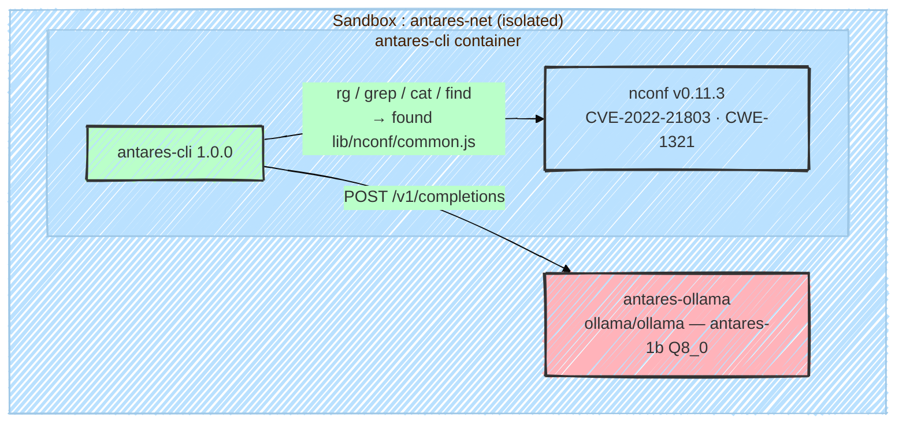

Yesterday, Cisco released its own fine tuned models (SLMs) based on IBM's Granite 4.0, with its Antares CLI, you can use it to inspect your Repo / Package for CVEs, 
2 variants available, 350M & a 1B versions, a 3B version is being released however not on Huggingface yet.
You can run it easily on your local machine, 
It does not need internet access to search for CVEs, it was trained on the exisiting ones, 
So to test it i spin up a small sandbox, using Ollama,
Using a Production level repo @ https://github.com/indexzero/nconf/tree/v0.11.3 which was identified in **CVE-2022-21803** (Prototype Pollution, CWE-1321),

The agent were able to identify a vurenable file indeed (**`lib/nconf/common.js`**), however it could not point out the main culprit that was mentiond in the cve which is (**`lib/nconf/stores/memory.js`**)

**Verdict** : still gonna run more tests, but its a good start for Cisco i think, however, i dont believer Baking the existing CVEs into the model's training is the way to go, tool using is the identifiec best practice now or Cisco can offer a Vector Database for the model to refer to so it can get up to date info 

```bash
$ docker exec -it antares-cli antares

  Target:   /workspace/repo
  Mode:     query — single CWE-scoped scan
  CWE IDs:  CWE-1321
  Budget:   15 tool calls
  Profile:  antares-ollama (antares-1b · http://antares-ollama:11434/...)
  Reports:  disabled

  ▸ Launch

╭─────────────────────────────── SCAN SUMMARY ────────────────────────────────╮
│ Status                Complete                                               │
│ Findings              1                                                      │
│ Affected files        1                                                      │
│ CWEs checked          1                                                      │
│ CWE IDs with findings CWE-1321                                               │
│ Duration              925.31s (~15 min, CPU only, no GPU)                    │
│ Total tool calls      11 / 15                                                │
╰──────────────────────────────────────────────────────────────────────────────╯

╭─────────────────────────────────── FINDING ─────────────────────────────────╮
│ Title     Improperly Controlled Modification of Object Prototype Attributes  │
│           ('Prototype Pollution')                                            │
│ File      lib/nconf/common.js                                                │
│ CWE       CWE-1321                                                           │
│ Rank      1                                                                  │
╰──────────────────────────────────────────────────────────────────────────────╯
```



References:
- [Introducing Antares: The Most Efficient Open-Weight AI Models for Vulnerability Localization](https://blogs.cisco.com/ai/introducing-antares-the-most-efficient-open-weight-ai-models-for-vulnerability-localization)
- [Antares 1B Model on Hugging Face](https://huggingface.co/fdtn-ai/antares-1b/tree/main)
