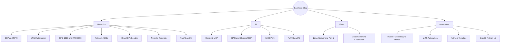

This is the first note — a place for quick thoughts, diagrams, and observations without needing to write a full article.

Here is a map of all the blog posts published so far, grouped by topic:

```mermaid
graph TD
    Blog((Sam7oon Blog))

    Blog --> Networks
    Blog --> AI
    Blog --> Linux
    Blog --> Automation

    Networks --> N1[BGP and RPKI]
    Networks --> N2[gNMI Automation]
    Networks --> N3[RFC-1918 and RFC-6598]
    Networks --> N4[Network ASICs]
    Networks --> N5[DrawIO Python Lib]
    Networks --> N6[Netmiko Template]
    Networks --> N7[PyATS and AI]

    AI --> A1[Context7 MCP]
    AI --> A2[RAG and Chroma MCP]
    AI --> A3[AI 3D Print]
    AI --> A4[PyATS and AI]

    Linux --> L1[Linux Networking Part 1]
    Linux --> L2[Linux Command Cheatsheet]

    Automation --> AU1[Huawei Cloud Engine Ansible]
    Automation --> AU2[gNMI Automation]
    Automation --> AU3[Netmiko Template]
    Automation --> AU4[DrawIO Python Lib]
```
