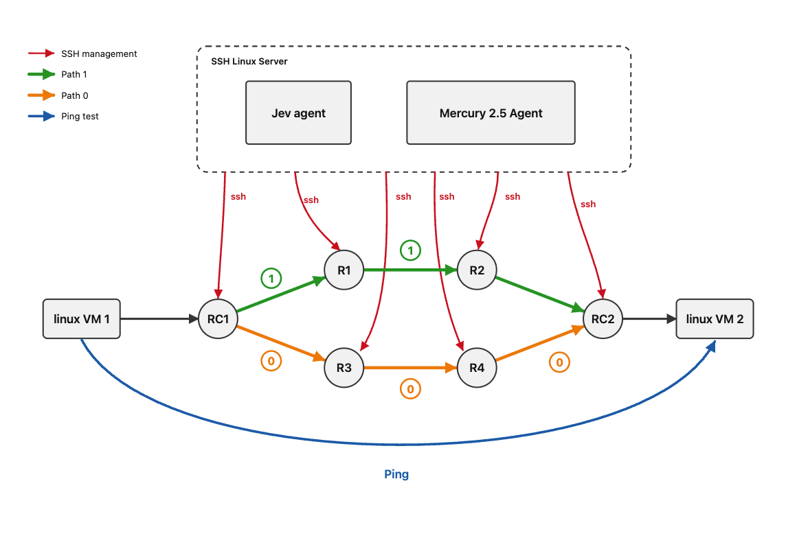

Jev compared to GPT style models in a jeffy, 

Most of Jev showcases online focuses on Evals, or on how fast and cheap can you run AI API call to it, however , this is not useful for me a network engineer, 

In this one, am utilizing 2 Model types to acheves some cool test case, 

1) Diffusion model @ Mercurey 2.5 from Iception, which is capable of generating 1000Toks/sec - will be used for configuration changes and taking actual actions.
2) RLCD Model @ Jev from Typeface, will be used as the monitor of the topology and the trigger for the failover.

Why are doing this, instead of using a Dynamic routing protocol , i wnated to see if using models ,w e can acheive the same smartness and fast failover process,

And also for fun,

# Lab topology
so the lab is as follows : 

Its pretty simple, we have 2 paths, primary is used with Static routes, the Linux Monitoring the routers is connected to all these routers which are FRR, and waiting for a failure to happen, then it will trigger the Actions agent running the Mecurey 2.5 model , to actually take the actions and validate.

Some show commands, so you can understand the current things running : 

> **_NOTE:_**  -Not a promotion- This lab was deployed on WWT's Kubernetes Sandbox lab on the WWT ATC Platform, its a nice way to try stuff out.

## Failover replay - OSPF vs agent stack

Identical failure (R1 pod deleted) injected into both labs. The animation runs on the real wall-clock timestamps recorded in each run log, with the node highlighted at the moment its log line appears.

<iframe src="/blog/ospf-failover-replay.html" width="100%" height="475" loading="lazy" scrolling="no" style="border:0;display:block" title="OSPF vs agent failover replay"></iframe>

# Refernces
- https://www.langchain.com/blog/building-a-harness-with-jev
- https://typesafe.ai/blog/introducing-system-one-models-and-jev
-
