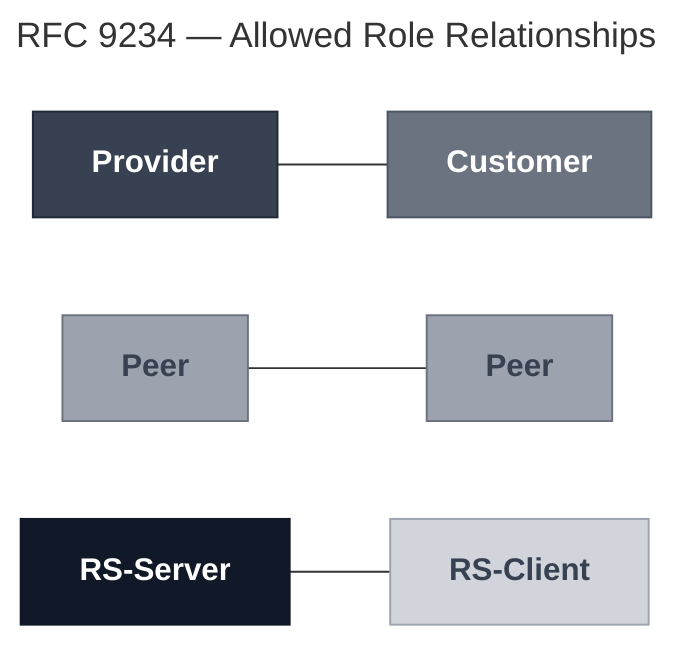
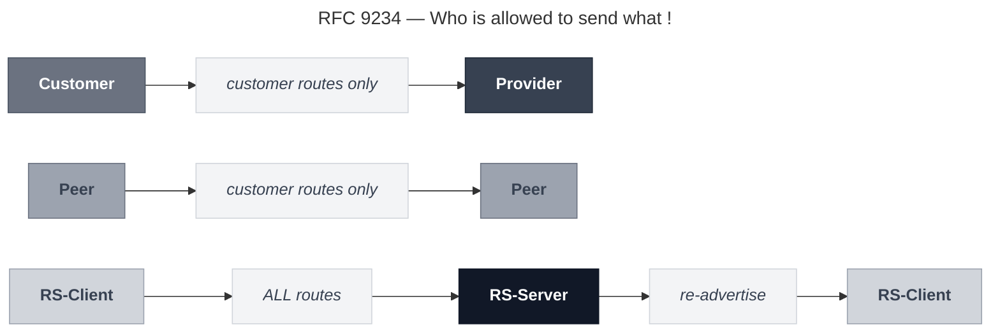
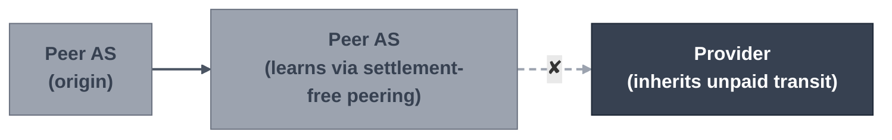
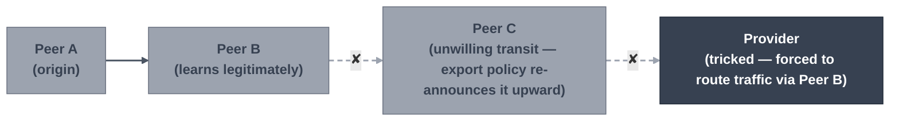
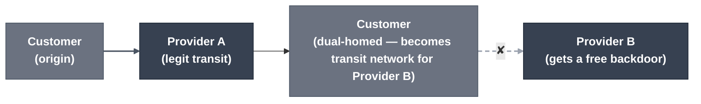
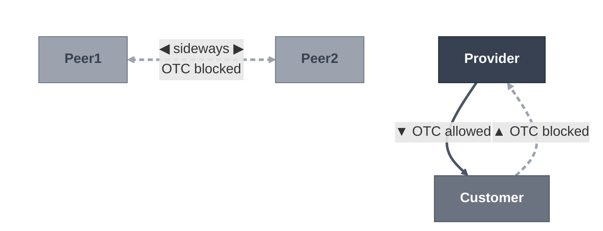
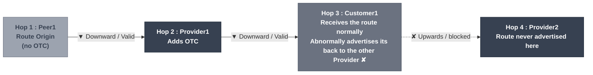

# RFC 9234 : BGP Roles and Route Leak Prevention

In 2022 , RFC 9234 was released to adopt a new Attribute for BGP that would make Internet's backbone route leak prevention a lot simpler, by strictly defining the relationship between BGP Peers, this was no customer can cause a blackholing in the internet backbone mistakenly, however it does not address AS hijacking to be clear, specially advertising something that it has not business doing, and make it Autonomous (Safe from human mistakes).

Instead of having to write export/import maps, for each relation that you have with your peer, or even with writing them, in order to have extra level of failure prevention, 

Clear BGP Attribute that define the relation between 2 peers, while now its optional and transitive, hopefully in the future, it would be adopted by all Tier 1 providers in the backbone, since they are the most expansive, and effective deployers of such standards, they are capable of pushing the standard to more organization.

There is 2 parts to understand  in this RFC :

1. Peering relations.
2. OTC Attribute - Only To Customer.

These are the only roles allowed, otherwise, the BGP session wont establish if you configure roles on both sides of the neigbhourship.

## Allowed relations




- Quickly to show you it in real setup, following is a valid and invalid case : 

  - **Customer <-> Provider : (Valid**)
    The role capability (9) is our RFC indicator that this neighbour have a role configured.

    ```bash
    2026/09/19 06:55:32 10.0.2.2 rcvd OPEN w/ optional parameter type 2 (Capability) len 6
    2026/09/19 06:55:32 10.0.2.2 OPEN has MultiProtocol Extensions capability (1), length 4
    2026/09/19 06:55:32 10.0.2.2 OPEN has 4-octet AS number capability (65), length 4
    2026/09/19 06:55:32 10.0.2.2 OPEN has Role capability (9), length 1 <<<<<< RFC9234 Role
    2026/09/19 06:55:32 10.0.2.2 received hostname provider1, domainname ...
    2026/09/19 06:55:32 10.0.2.2 [FSM] Receive_OPEN_message (OpenSent->OpenConfirm), fd 25
    2026/09/19 06:55:32 10.0.2.2 went from OpenSent to OpenConfirm
    2026/09/19 06:55:32 10.0.2.2 [FSM] Receive_KEEPALIVE_message (OpenConfirm->Established), fd 25
    2026/09/19 06:55:32 10.0.2.2 went from OpenConfirm to Established
    2026/09/19 06:55:33 send End-of-RIB for IPv4 Unicast to 10.0.2.2
    2026/09/19 06:55:33 bgp_update_receive: rcvd End-of-RIB for IPv4 Unicast from 10.0.2.2
    ```

  - **Provider <-> Peer : (Invalid)**
    Here you can see the Role capabiility is also configured on both peers, however they havea. mismatching Relathionship causing the neigborship to fail , which protects both networks, since these 2 providers, have not agreed toactually what is their relation, so letting them fail is a better choice.

    ```bash
    2026/09/19 06:56:13 10.0.5.2 [FSM] BGP_Start (Idle->Connect)
    2026/09/19 06:56:13 10.0.5.2 went from Idle to Connect
    2026/09/19 06:56:13 10.0.5.2 [FSM] TCP_connection_open (Connect->OpenSent)
    2026/09/19 06:56:13 10.0.5.2 sending OPEN, version 4, my as 64701, holdtime 180, id 100.64.71.1
    2026/09/19 06:56:13 10.0.5.2 rcv OPEN, version 4, remote-as (in open) 64503, holdtime 180, id 100.64.3.3
    2026/09/19 06:56:13 10.0.5.2 OPEN has Role capability (9), length 1
    2026/09/19 06:56:13 %NOTIFICATION: sent to neighbor 10.0.5.2 2/11 (OPEN Message Error/Role Mismatch) 0 bytes
    2026/09/19 06:56:13 10.0.5.2 went from OpenSent to Idle
       ...(8 seconds later, it tries all over again)...
    2026/09/19 06:56:21 10.0.5.2 went from Idle to Connect
    2026/09/19 06:56:21 %NOTIFICATION: sent to neighbor 10.0.5.2 2/11 (OPEN Message Error/Role Mismatch) 0 bytes
    2026/09/19 06:56:21 10.0.5.2 went from OpenSent to Idle
    ```

    

- RS-Server and RS-Client is a relation that involves Internet Exchanges and Route Servers of the internet.

- Customer does not mean CPE or actual end customer, it means a provider that is purchaing transit from anonther provider.

- Provider can also be a Peer, or a Customer, the relation is defined per BGP Peering instead of Per device or Intity.

- If you are paired with another Entity, and have a complicated relationship with multiple possibilties, then you should setup "Complex Relationship" using multiple BGP sessions with that entity, and control the prefdixes probagated through each session, based on the relation type.

- ```mermaid
  graph LR
      classDef A fill:#374151,stroke:#1f2937,color:#fff,font-weight:bold;
      classDef B fill:#111827,stroke:#111827,color:#fff,font-weight:bold;
  
      A["AS 100"]:::A
      B["AS 200"]:::B
  
      A ---|"EBGP Session 1: </br>Provider ↔ Customer"| B
      A ---|"EBGP Session 2: </br>Peer ↔ Peer"| B
      A ---|"EBGP Session 3: </br>Customer ↔ Provider"| B
  ```

- Peer to Peer relation is a Free connection, that is acceptable between Tier1 or Large network providers, that accept the transition of Routes between them for equal benefit, here no money exchanges hands.

## Who is allowed to do what ! 



## why is that standard is needed !

---

### Leak 1 — Peer-learned routes pushed upstream

A peer AS learns routes over a settlement-free peering, then mistakenly exports them upstream to its own provider. The provider inherits unpaid transit for routes it has no business relationship with.



---

### Leak 2 — Route-Map Human Mistake

A peer receives a route and transmits it mistakenly, for lack of route-map control, resulting in its network being used for transit, free of charge. The route crosses sideways to another peer, whose own export policy pushes it further up — dragging an innocent provider into the path.



---

### Leak 3 — Utilizing the Customer Network as Transit

Backbone traffic routes through a customer network by mistake: a dual-homed customer re-announces routes received from one provider to another, becoming a transit network. Provider B gets a free backdoor through the customer — this is the exact case the lab's OTC demo blocks.



---


## OTC (Only To Customer) Attribute

Intriduced in the RFC, BGP attribute  type 35, gets stamped once and then cannot be changed, but optionally transitive meaning , that an AS may actually strip it away,



We can just to get into seeing how it works :  (All show commands are from FRR Router)



1) Hop 1 : Originating provider , 
   ```bash
   # How bgp config looks like in FRR
   peer1# show run
   router bgp 64502
    ......
    neighbor 10.0.1.2 remote-as 64503
    neighbor 10.0.1.2 local-role peer
    neighbor 10.0.6.3 remote-as 64702
    neighbor 10.0.6.3 local-role peer
    ......
    
    # And how a peer does not stamp its route , its done by Customer or Provider 
    peer1\# show bgp ipv4 unicast 198.51.100.0/24
     198.51.100.0/24
       0.0.0.0 from 0.0.0.0 (100.64.2.2)
         Origin IGP, metric 0, weight 32768, valid, sourced, local, best
   ```

2) Hop 2  : Stamps the route once it receives it from its customer above, anther way actually to also stamp the route from ther customer side on export, depends on whether its compliant or not.
   ```bash
   provider1\# show bgp ipv4 unicast 198.51.100.0/24
     64502
       10.0.1.3 from 10.0.1.3 (100.64.2.2)
         Origin IGP, metric 0, valid, external, otc 64502, best
                                        ^^^^^^^^^^^
   ```

3) Hop 3 : Normally customer receives the route, nothing fancy.

4) Hop 4 : Customer to Provider 2 ,
   Shouldn't advertise to provider 2, otherwise it will cause the Hairpin leak case, and on FRR you can see it stated clearly on the route : 

   ```bash
   customer1\# show bgp ipv4 unicast 198.51.100.0/24
   BGP routing table entry for 198.51.100.0/24, version 15
   Paths: (1 available, best \#1, table default)
     Not advertised to any peer   <<<<<<<<<<<<<<<<< Not advertised from customer1
     64503 64502
       10.0.2.2 from 10.0.2.2 (100.64.3.3)
         Origin IGP, valid, external, otc 64502, best (First path received)
                                      ^^^^^^^^^. You see OTC value here - matching Peer1's
         Last update: Sat Sep 19 14:05:06 2026
   ```

To simplify who stamps the OTC : 

```
# Who Stamps and who Dont : 
Originating AS → Stamps its own AS Number into OTC
Customer   ← learns from Provider/Peer/RS   →  stamps sender's ASN
Peer       ← learns from Provider/Peer/RS   →  stamps sender's ASN
RS-Client  ← learns from RS-Server        →  stamps sender's ASN
Provider   → forwards unstamped route down  →  stamps own ASN
RS-Server  → forwards unstamped route down  →  stamps own ASN
Route already carrying OTC → passes through →  no re-stamp

# Who should accept route , supress or advertise ! 
── OUT: advertising a route that carries OTC ─────────────────────────────
Customer   → to Provider     →  ✘ suppressed   (OTC never travels UP)
Peer       → to Peer         →  ✘ suppressed   (OTC never travels SIDEWAYS)
RS-Client  → to RS-Server    →  ✘ suppressed
Provider   → to Customer     →  ✓ allowed      (downward is legal)
RS-Server  → to RS-Client    →  ✓ allowed      (downward is legal)

── IN: receiving a route that carries OTC ────────────────────────────────
Provider   ← from Customer   →  ✘ REJECT       (leak — OTC can't come from below)
RS-Server  ← from RS-Client  →  ✘ REJECT       (leak)
Peer       ← from Peer, otc ≠ peer's own ASN →  ✘ REJECT   (leak/tampered)
Peer       ← from Peer, otc = peer's own ASN →  ✓ accepted
Customer   ← from Provider   →  ✓ accepted     (normal downward flow)
```

## Vendor current support

We are going to use FRR, since its the easiest way to set it up, but following is the list of vendors/OS version already compitable with RFC9234, not all vendros, but the most well known ,

| Vendor / OS                          | RFC 9234                           | First release                                          | Config keyword                                      | Source                                                       |
| ------------------------------------ | ---------------------------------- | ------------------------------------------------------ | --------------------------------------------------- | ------------------------------------------------------------ |
| **FRRouting**                        | Yes                                | 8.4                                                    | `neighbor X local-role <role> [strict-mode]`        | [FRR docs](https://docs.frrouting.org/en/latest/bgp.html#bgp-roles-and-only-to-customers), [netlab](https://netlab.tools/plugins/bgp.policy/) |
| **BIRD**                             | Yes                                | 2.0.11                                                 | not checked                                         | [Cloudflare](https://blog.cloudflare.com/rfc9234-bgp-role-model/), [netlab](https://netlab.tools/plugins/bgp.policy/) |
| **OpenBGPD**                         | Yes                                | 7.5 (July 2022)                                        | `role <role>`                                       | [undeadly](https://undeadly.org/cgi?action=article;sid=20220716101930), [man page](https://man.openbsd.org/bgpd.conf) |
| **Juniper Junos OS**                 | Yes                                | 25.2R1 (MX platforms and cRPD only)                    | `otc-local-role <role>`, strict is the default mode | [Release notes](https://www.juniper.net/documentation/us/en/software/junos/release-notes/25.2/junos-release-notes-25.2r1/topics/new-features/feature-descriptions/routing-protocols-3.html), [config guide](https://www.juniper.net/documentation//us/en/software/junos/bgp/topics/topic-map/bgp-route-leak-prevention.html) |
| **Juniper Junos OS Evolved**         | Yes                                | 25.2R1 (selected ACX7xxx, PTX10xxx and QFX5xxx models) | same                                                | [Release notes](https://www.juniper.net/documentation/us/en/software/junos/release-notes/25.2/junos-evo-release-notes-25.2r1/topics/new-features/feature-descriptions/routing-protocols-3.html) |
| **MikroTik RouterOS 7**              | Yes per Cloudflare, but unverified | not confirmed                                          | `local.role`                                        | [Cloudflare](https://blog.cloudflare.com/rfc9234-bgp-role-model/), [forum](https://forum.mikrotik.com/t/rfc-9234-implementation-status-roles-but-no-otc/170495) |
| **Cisco IOS XR**                     | Planned                            | 26.4.1                                                 | `otc-local-role` (no route-server role)             | [XRdocs](https://xrdocs.io/bgp/tutorials/bgp-only-to-customer-otc-on-ios-xr) |
| **Arista EOS**                       | No                                 | n/a                                                    | n/a                                                 | [Cloudflare](https://blog.cloudflare.com/rfc9234-bgp-role-model/) |
| **Huawei**                           | No                                 | n/a                                                    | n/a                                                 | [Cloudflare](https://blog.cloudflare.com/rfc9234-bgp-role-model/) |
| **Nokia SR OS**                      | No                                 | n/a                                                    | n/a                                                 | [Cloudflare](https://blog.cloudflare.com/rfc9234-bgp-role-model/) |
| Extreme SLX-OS, ArcOS, GoBGP, ExaBGP | No                                 | n/a                                                    | n/a                                                 | [Cloudflare](https://blog.cloudflare.com/rfc9234-bgp-role-model/) |

## Adoptability and Optionality 

While its been a standard released on 2022, as of the 3rd quarter of 2026, internet backbone providers still not fully deployed the config parameter, including some are actually stripping away the OTC value set be compliant providers, once a route have been traversing their network.

You can check Cloudflare's Adoption radar, if you would like to see the up to date status @ https://blog.cloudflare.com/route-leak-detection-with-cloudflare-radar/

## References

- https://blog.cloudflare.com/rfc9234-bgp-role-model/
- [Cloudflare Blog: BGP Role model: tracking the adoption of RFC 9234](https://blog.cloudflare.com/rfc9234-bgp-role-model/)
- [RFC 9234 — Route Leak Prevention and Detection Using Roles in UPDATE and OPEN Messages](https://datatracker.ietf.org/doc/html/rfc9234)
- [RFC 7908 — Problem Definition and Classification of BGP Route Leaks](https://datatracker.ietf.org/doc/html/rfc7908)
- [RFC 7606 — Revised Error Handling for BGP UPDATE Messages](https://datatracker.ietf.org/doc/html/rfc7606)
- [FRR BGP documentation — BGP Roles and Only to Customers](https://docs.frrouting.org/en/latest/bgp.html#bgp-roles-and-only-to-customers)
- [Cloudflare: ASPA — making Internet routing more secure](https://blog.cloudflare.com/aspa-secure-internet/)
- [Cloudflare Radar: route leak detection service](https://blog.cloudflare.com/route-leak-detection-with-cloudflare-radar/)
- [Cloudflare: a closer look at a BGP anomaly in Venezuela](https://blog.cloudflare.com/bgp-route-leak-venezuela/)
- https://blog.cloudflare.com/route-leak-detection-with-cloudflare-radar/
- https://blog.cloudflare.com/aspa-secure-internet/
- https://datatracker.ietf.org/doc/html/rfc7854
- https://radar.cloudflare.com/routing
